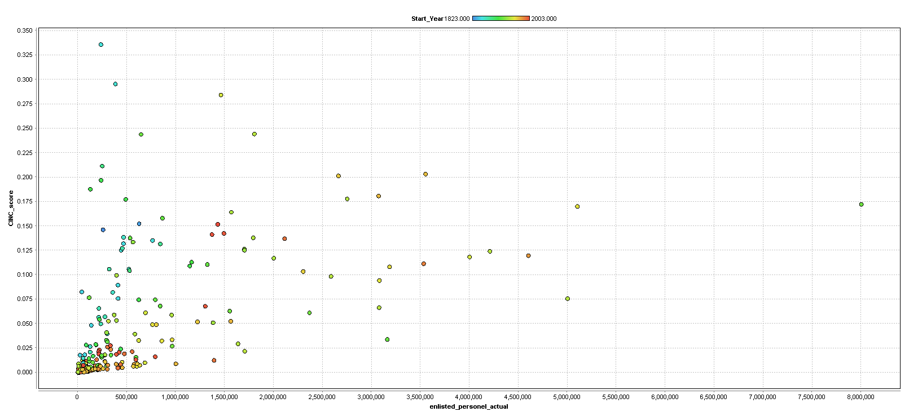

<h1 align="center">Predicting Interstate Conflict Initiation by China, Iran, or Russia</h1>
<h2 align="center">Christian Davis & Mark Mathies</h2>

<h3>Introduction:</h3>

While researching for our Capstone Project on future global interstate conflict, we found a data set called “Correlates of War” (COW). With this dataset, we could try to use machine learning to predict whether a country, specifically China, Iran, and Russia, could initiate an interstate conflcit in the future. Therefore, our research problem is: “How can we use machine learning to predict whether Iran, Russia, or China may initiate future interstate conflict?”

<h3>Description of the Data:</h3>

The COW project was founded in 1963 by J. David Singer, a professor from the University of Michigan, and is used for academic study on war. This dataset has quantitative and qualitative data on all global interstate conflict between the years 1816-2007, such as:

<ul>
  <li>War names</li>
  <li>What states were involved</li>
  <li>Which side the states were on</li>
  <li>Who initiated</li>
  <li>Where the war was fought</li>
  <li>Outcome of the war</li>
  <li>Year it started/ended</li>
  <li>How many people died for each state</li>
  <li>Military expenditure for each state (some in US dollars, some in British pounds)</li>
  <li>Military personnel</li>
  <li>State resource production</li>
  <li>State demographics</li>
</ul>

<h3>Necessary Visualizations:</h3>

<h3>Model Used and Justification:</h3>

<h3>Results:</h3>
