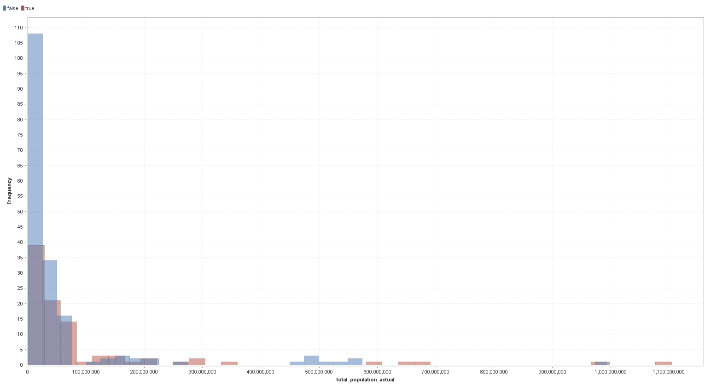
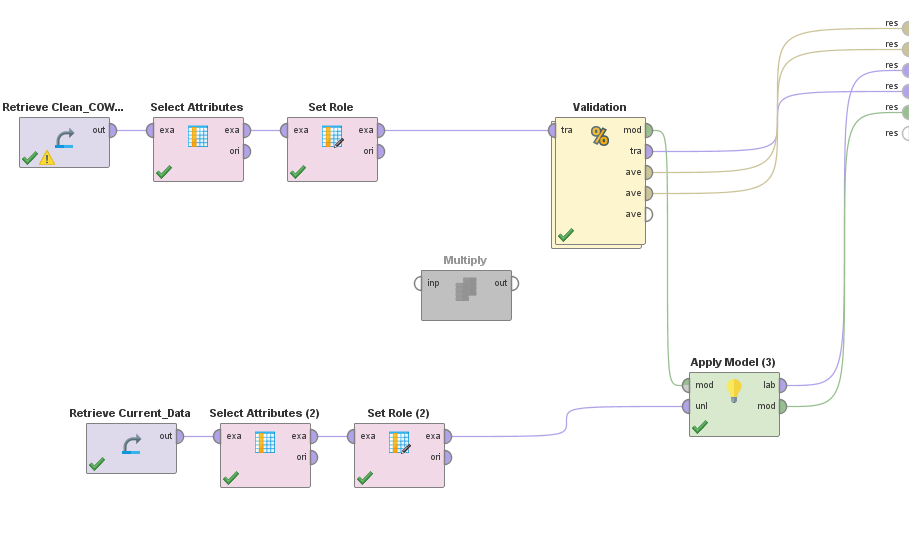
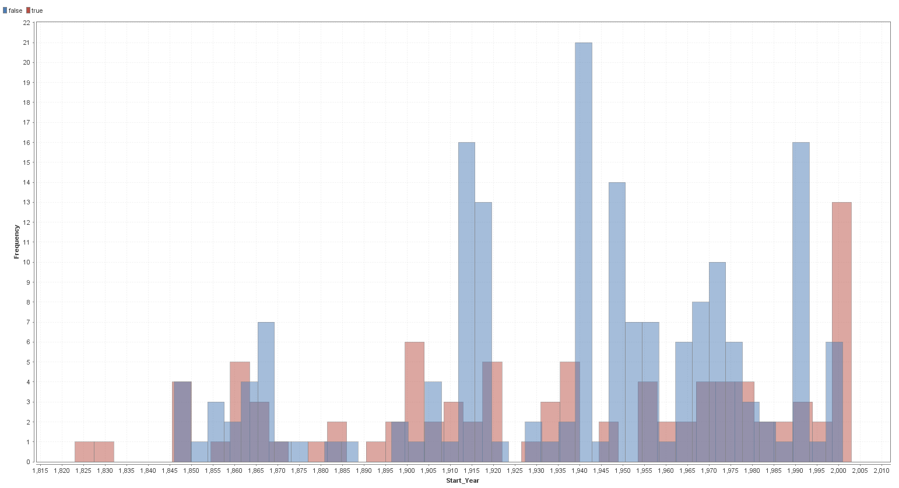
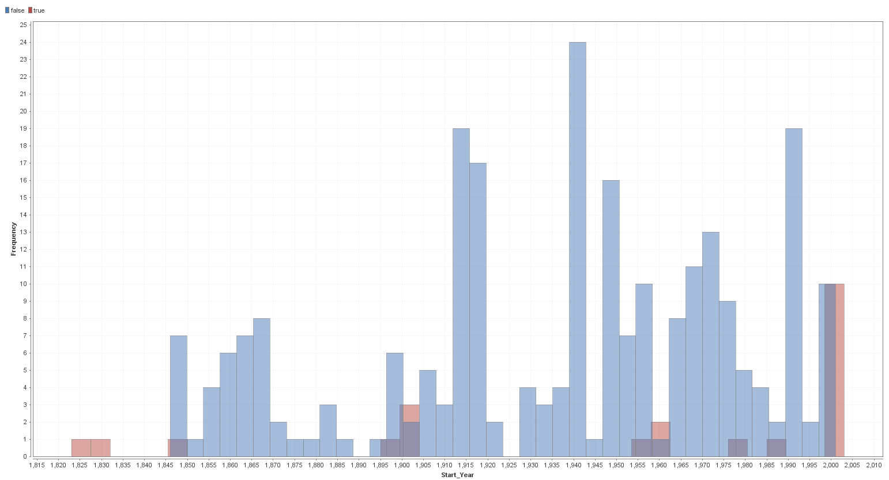

<h1 align="center">Predicting Interstate Conflict Initiation by China, Iran, or Russia</h1>
<h2 align="center">Christian Davis & Mark Mathies</h2>

<h3>Introduction:</h3>

While researching for our Capstone Project which seeks to answer “What is the likelihood of global interstate conflict by 2025 due to the effects of expanding and contracting Chinese, Iranian, and Russian sphere of influence,” we were suggested to explore a data set known as the <a href="http://www.correlatesofwar.org/data-sets">Correlates of War (COW) Project</a>. The COW project seeks to identify specific correlates associated with conflict so that researchers can have a better understanding of what causes interstate conflict in order to predict or avoid it in the future. We believed that it would be possible to adapt the research from the COW project to help answer our research question by utilizing its identified correlates in machine learning in order to predict whether China, Iran, or Russia would initiate an interstate conflict in the near future. Therefore, our current research question is: “How can machine learning help us understand if China, Iran, or Russia will initiate future interstate conflict by 2019?”

<h3>Description of the Data:</h3>

The COW project was founded in 1963 by J. David Singer, a professor from the University of Michigan, and is used for academic study on war with the aim to identify correlates associated with the initiation of conflict. This dataset contains both quantitative and qualitative data on all global interstate conflict between the years 1823-2007, such as:

<ul>
  <li>The names of wars and conflicts</li>
  <li>What states were involved</li>
  <li>Which side the states were on</li>
  <li>Who initiated</li>
  <li>Where the war was fought</li>
  <li>The outcome of the war</li>
  <li>The year the conflict started/ended</li>
  <li>How many people died for each state</li>
  <li>Military expenditure for each state (some in US dollars, some in British pounds)</li>
  <li>The Enlisted military personnel in service</li>
  <li>State rot iron and steel production</li>
  <li>Various other state demographics</li>
</ul>

To identify whether the three states will initiate war in the future, we compared the historical COW data with China's, Russia's, and Iran's current data (year 2016). We gathered total population, urban population, and military personnel data from the <a href="https://www.worldbank.org/">World Bank Group</a>, and gathered iron steel production data from the <a href="https://www.worldsteel.org/en/dam/jcr:f9359dff-9546-4d6b-bed0-996201185b12/World+Steel+in+Figures+2018.pdf ">World Steel Association</a>.

<h4>Exploring the Data:</h4>

In order to explore the data and identify possible patterns, we had to merge the COW dataset containing state demographics and the COW dataset detailing militarized interstate conflict using SQL. After this, we removed rows of data where a cell was unknown, and removed columns unnecessary to the machine learning process. The resulting table of clean data can be found here <a href="https://docs.google.com/spreadsheets/d/1wyEdx6CtPUkO7GSa9e6o4iKUGw9eB_Jp-G_9HkeXADs/edit?usp=sharing">(Clean COW Dataset)</a>. Using this, we wanted to visualize how intestate conflict has been historically initiated. To gauge how the model would perform with the data, we compared how interstate conflict has been initiated historically with how the model predicted historical conflict initiation.

<h5>Frequency of Conflict by Total Population</h5>

<h3>Model Used and Justification:</h3>

We used a Random Forest model to predict whether China, Iran, or Russia would initiate future interstate conflict. Initially we thought a Neural Network (NN) model or Decision-Tree model would work best for this data. This is because we had a lot of variables that included inputs, weights, and wanted predicted outcomes. The Decision-tree model worked better than the NN model because our inputs had very different features (some quantitative, some qualitative). However, we found the Random Forest model to work best as it 

<h4>Process:</h4>

 Talk about model process and parameters

<h5>Actual History of Conflict by Initiation vs. Prediction of History of Conflict by Initiation</h5>

Actual:

Predicted:

<h3>Results:</h3>

<h3>Conclusion, Limitations, and Suggestions for Improvement:</h3>

<h3>References:</h3>
<ul>
 <li><a href="https://docs.google.com/spreadsheets/d/1wyEdx6CtPUkO7GSa9e6o4iKUGw9eB_Jp-G_9HkeXADs/edit?usp=sharing">Clean COW Dataset</a></li>
 <li><a href="http://www.correlatesofwar.org/data-sets">Correlates of War Project</a></li>
 <li><a href="https://www.worldbank.org/">World Bank Group</a></li>
 <li><a href="https://www.worldsteel.org/en/dam/jcr:f9359dff-9546-4d6b-bed0-996201185b12/World+Steel+in+Figures+2018.pdf ">World Steel Association</a></li>
</ul>
